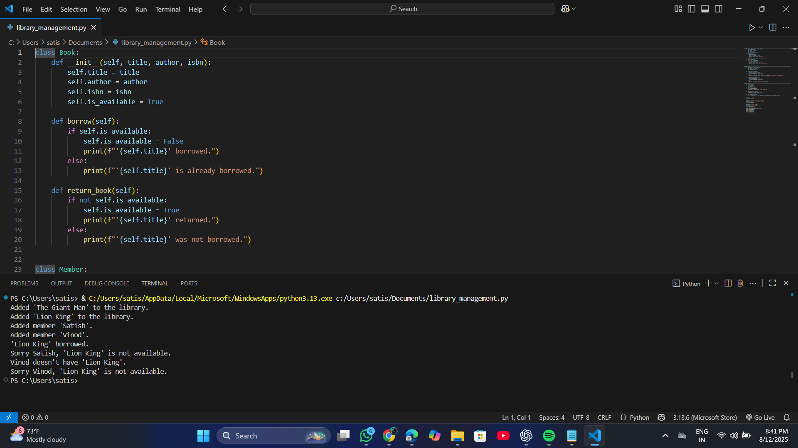

# 📚 Library Management System

A simple object-oriented Python program to manage a small library.  

## 🚀 Features
- Add books to the library  
- Add members to the library  
- Borrow books (with availability check)  
- Return books  
- Search books by title  

## 🛠 Tech Stack
- Python (Classes & Objects)
## 📸 Screenshot

